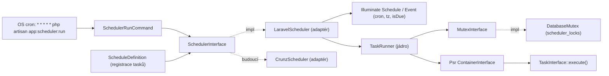

# Scheduler a Mutex – návrh rozhraní a Laravel adaptér

## Klíčové principy

- Jádro (`App\Scheduling\Contracts` + hodnotové objekty + `TaskRunner`) závisí **pouze na PHP a PSR** (`Psr\Container\ContainerInterface`, `Psr\Clock\ClockInterface`, `Psr\Log\LoggerInterface` – všechny už jsou ve `vendor/psr`). Žádný `Illuminate\*` ani `Crunz\*` import.
- **Mutex je plně mimo Laravel.** Zjištění z kódu: Laravel `withoutOverlapping()` dělá `skip(fn => mutex->exists())` a teprve pak `mutex->create()` – neatomické check-then-act (`vendor/laravel/framework/src/Illuminate/Console/Scheduling/ManagesAttributes.php:180`). Adaptér proto Laravel mutex vůbec nepoužije; zámek se získává atomicky v našem `TaskRunner` těsně před spuštěním tasku.
- Laravel Scheduler se využije jen na to, v čem je bezpečný: parsování crontab výrazu, timezone, výpočet „je due“, `schedule:list`. Crunz nabízí totéž (`Crunz\Event::cron()`, `isDue(DateTimeZone)`, `Schedule::dueEvents()`), takže výměna adaptéru je 1 třída.
- Task je PHP třída implementující `TaskInterface`, resolvovaná přes PSR-11 kontejner (Laravel `Container` implementuje `Psr\Container\ContainerInterface`).



## Struktura souborů (nový namespace `App\Scheduling` uvnitř `app/`)

- `app/Scheduling/Contracts/SchedulerInterface.php`
- `app/Scheduling/Contracts/TaskInterface.php`
- `app/Scheduling/Contracts/MutexInterface.php`
- `app/Scheduling/Contracts/LockInterface.php`
- `app/Scheduling/CronExpression.php` (value object)
- `app/Scheduling/ScheduledTask.php` (readonly DTO – definice tasku)
- `app/Scheduling/TaskRunStatus.php` (enum)
- `app/Scheduling/TaskRunResult.php`, `app/Scheduling/RunReport.php`
- `app/Scheduling/TaskRunner.php` (jádro: mutex + resolve + execute)
- `app/Scheduling/ScheduleDefinition.php` (jediné místo, kde aplikace registruje své tasky)
- `app/Scheduling/Exceptions/{SchedulerException,DuplicateTaskException,InvalidCronExpressionException,TaskNotFoundException,MutexException}.php`
- `app/Scheduling/Adapters/Laravel/LaravelScheduler.php`
- `app/Scheduling/Mutex/DatabaseMutex.php`, `app/Scheduling/Mutex/DatabaseLock.php`
- `app/Providers/SchedulingServiceProvider.php` (+ zápis do `bootstrap/providers.php`)
- `app/Console/Commands/SchedulerRunCommand.php` (`app:scheduler:run`)
- `config/scheduler.php`
- `database/migrations/xxxx_create_scheduler_locks_table.php`
- testy v `tests/Unit/Scheduling/*`, `tests/Feature/Scheduling/*`

## Rozhraní – detail

### `TaskInterface`

```php
interface TaskInterface
{
    /** Provede úlohu. Selhání signalizuje vyhozením výjimky. */
    public function execute(): void;
}
```

### `CronExpression` (final readonly VO)

```php
final readonly class CronExpression
{
    /** @throws InvalidCronExpressionException při jiném než 5-polovém crontab zápisu */
    public function __construct(public string $value) {}
    public static function fromString(string $expression): self;
    public static function everyMinute(): self;   // '* * * * *'
    public function __toString(): string;
}
```

Validace v jádře: 5 whitespace-oddělených polí a povolené znaky `0-9 * / , - A-Z ?`. Sémantickou validaci (rozsahy) dělá adaptér (Laravel/Crunz oba používají `dragonmantank/cron-expression`).

### `ScheduledTask` (final readonly DTO)

```php
final readonly class ScheduledTask
{
    /**
     * @param non-empty-string              $name             Unikátní identifikátor, zároveň klíč mutexu.
     * @param class-string<TaskInterface>   $taskClass        Třída resolvovaná z kontejneru až při spuštění.
     * @param bool                          $withoutOverlapping  Zamykat přes MutexInterface (výchozí true).
     * @param positive-int                  $lockTtlSeconds   Po uplynutí je zámek považován za opuštěný (ochrana proti crashi).
     * @param ?DateTimeZone                 $timezone         null = výchozí z config('scheduler.timezone').
     */
    public function __construct(
        public string $name,
        public CronExpression $expression,
        public string $taskClass,
        public bool $withoutOverlapping = true,
        public int $lockTtlSeconds = 3600,
        public ?DateTimeZone $timezone = null,
        public ?string $description = null,
    ) {}
}
```

### `SchedulerInterface`

```php
interface SchedulerInterface
{
    /** @throws DuplicateTaskException pokud task se stejným name už existuje */
    public function schedule(ScheduledTask $task): void;

    /** @return list<ScheduledTask> */
    public function tasks(): array;

    /** @throws TaskNotFoundException */
    public function task(string $name): ScheduledTask;

    /** Tasky, jejichž cron odpovídá minutě $now (respektuje timezone tasku). @return list<ScheduledTask> */
    public function dueTasks(DateTimeImmutable $now): array;

    /** Spustí všechny due tasky sekvenčně, každý pod mutexem; nikdy nevyhazuje výjimku tasku – vrací report. */
    public function run(DateTimeImmutable $now): RunReport;

    /** Ruční spuštění jednoho tasku bez ohledu na cron (mutex se stále respektuje). @throws TaskNotFoundException */
    public function runTask(string $name, DateTimeImmutable $now): TaskRunResult;
}
```

### `MutexInterface` a `LockInterface`

```php
interface MutexInterface
{
    /**
     * Atomicky získá zámek. Vrací null, pokud jej drží někdo jiný a dosud neexpiroval.
     * @param non-empty-string $key
     * @param positive-int     $ttlSeconds
     * @throws MutexException při chybě úložiště (ne při kolizi)
     */
    public function acquire(string $key, int $ttlSeconds): ?LockInterface;

    public function isLocked(string $key): bool;

    /** Násilné uvolnění bez ohledu na vlastníka (ops nástroj). */
    public function forceRelease(string $key): void;

    /** Smaže expirované záznamy, vrací počet. */
    public function purgeExpired(): int;
}

interface LockInterface
{
    public function key(): string;
    public function owner(): string;                 // náhodný token (32 hex), identifikuje držitele
    public function expiresAt(): DateTimeImmutable;
    /** Prodlouží TTL jen pokud jsme stále vlastník; false = zámek mezitím ztracen. */
    public function refresh(int $ttlSeconds): bool;
    /** Uvolní jen pokud jsme stále vlastník; idempotentní. */
    public function release(): bool;
    public function isAcquired(): bool;
}
```

### Výsledky běhu

```php
enum TaskRunStatus: string { case Succeeded = 'succeeded'; case Failed = 'failed'; case SkippedLocked = 'skipped_locked'; }

final readonly class TaskRunResult
{
    public function __construct(
        public ScheduledTask $task,
        public TaskRunStatus $status,
        public DateTimeImmutable $startedAt,
        public DateTimeImmutable $finishedAt,
        public ?Throwable $exception = null,
    ) {}
    public function durationMs(): int;
}

final readonly class RunReport
{
    /** @param list<TaskRunResult> $results */
    public function __construct(public DateTimeImmutable $runAt, public array $results) {}
    public function hasFailures(): bool;
    /** @return list<TaskRunResult> */ public function failed(): array;
    public function count(): int;
}
```

## Jádro: `TaskRunner`

```php
final class TaskRunner
{
    public function __construct(
        private MutexInterface $mutex,
        private ContainerInterface $container,   // Psr\Container
        private ClockInterface $clock,           // Psr\Clock
        private LoggerInterface $logger,         // Psr\Log
    ) {}

    public function run(ScheduledTask $task): TaskRunResult;
}
```

Algoritmus: pokud `withoutOverlapping` → `acquire($task->name, $task->lockTtlSeconds)`; null → `SkippedLocked`. Jinak `$container->get($task->taskClass)`, ověřit `instanceof TaskInterface` (jinak `SchedulerException`), `execute()` v try/catch `Throwable` → `Failed` + log error; `finally` `$lock?->release()`.

## Laravel adaptér `LaravelScheduler implements SchedulerInterface`

- Konstruktor: `Illuminate\Console\Scheduling\Schedule $schedule, TaskRunner $runner, DateTimeZone $defaultTimezone`.
- `schedule()`: uloží do `array<string, ScheduledTask>`; do Laravel `Schedule` zaregistruje `->call(fn () => $this->runner->run($task))->cron((string) $task->expression)->name($task->name)->description(...)->timezone(...)`. **Nevolá** `withoutOverlapping()` (Laravel mutex se nepoužije). Vedlejší efekt: `php artisan schedule:list` tasky zobrazí a i případný `schedule:run` projde naším mutexem.
- `dueTasks($now)`: deterministicky přes `Event::nextRunDate($now, 0, allowCurrentDate: true)` a porovnání na minutu – nezávisí na `Carbon::now()`, testovatelné bez `setTestNow`.
- `run($now)`: `foreach dueTasks → runner->run()` → `RunReport`.

Budoucí `CrunzScheduler`: totéž s `Crunz\Schedule::run(Closure)->cron()` / `Event::isDue(DateTimeZone)`; `TaskRunner` a `DatabaseMutex` zůstávají beze změny.

## `DatabaseMutex`

- Tabulka `scheduler_locks`: `key string(191) PK`, `owner string(64)`, `acquired_at datetime`, `expires_at datetime` (index).
- Závislosti: `Illuminate\Database\ConnectionInterface`, `ClockInterface`, název tabulky z configu.
- `acquire()`: `DELETE WHERE key = ? AND expires_at <= now` a pak `INSERT`; `Illuminate\Database\UniqueConstraintViolationException` → `null`. Ostatní DB výjimky → `MutexException`.
- `DatabaseLock::release()`/`refresh()`: `UPDATE/DELETE ... WHERE key = ? AND owner = ?` (ownership check, vrací `affected > 0`).

## Konfigurace a wiring

- `config/scheduler.php`: `driver` (`laravel`), `timezone` (`env('SCHEDULER_TIMEZONE', config('app.timezone'))`), `mutex.driver` (`database`), `mutex.table`, `mutex.connection`, `mutex.default_ttl`.
- `SchedulingServiceProvider`: bind `MutexInterface → DatabaseMutex`, `ClockInterface → (Carbon 3 je PSR-20)` nebo malý `SystemClock`, `SchedulerInterface → LaravelScheduler` (singleton; po vytvoření zavolá `ScheduleDefinition::register($scheduler)`). Registrace v `bootstrap/providers.php`.
- `ScheduleDefinition::register(SchedulerInterface $scheduler): void` – obsahuje zakomentovaný vzor `new ScheduledTask(name: 'example', expression: CronExpression::fromString('0 3 * * *'), taskClass: ExampleTask::class)`.

## Příkaz `app:scheduler:run`

- Signature: `app:scheduler:run {--task= : Spustit pouze pojmenovaný task bez ohledu na cron} {--dry-run : Jen vypsat due tasky}`.
- `handle(SchedulerInterface $scheduler, ClockInterface $clock): int` – `$now = $clock->now()`, vypíše tabulku výsledků (name, status, duration), exit `Command::FAILURE` pokud `hasFailures()`.
- OS crontab: `* * * * * cd /path && php artisan app:scheduler:run >> /dev/null 2>&1`.

## Testy (Pest)

- `tests/Unit/Scheduling/CronExpressionTest` – validace zápisu.
- `tests/Unit/Scheduling/TaskRunnerTest` – fake mutex + fake kontejner: succeeded / failed (výjimka zachycena, zámek uvolněn) / skipped_locked / bez zámku při `withoutOverlapping=false`.
- `tests/Feature/Scheduling/DatabaseMutexTest` – druhý `acquire` vrací null, expirovaný zámek lze převzít, `release` cizím ownerem nic nesmaže, `refresh`, `purgeExpired`.
- `tests/Feature/Scheduling/LaravelSchedulerTest` – `dueTasks` podle cron výrazu a timezone pro dané `$now`, `DuplicateTaskException`, `run` vrací report, `runTask` ignoruje cron.
- `tests/Feature/Scheduling/SchedulerRunCommandTest` – `artisan('app:scheduler:run')` spustí due task, `--task`, exit code při selhání.

Po implementaci `vendor/bin/pint --dirty --format agent`.
